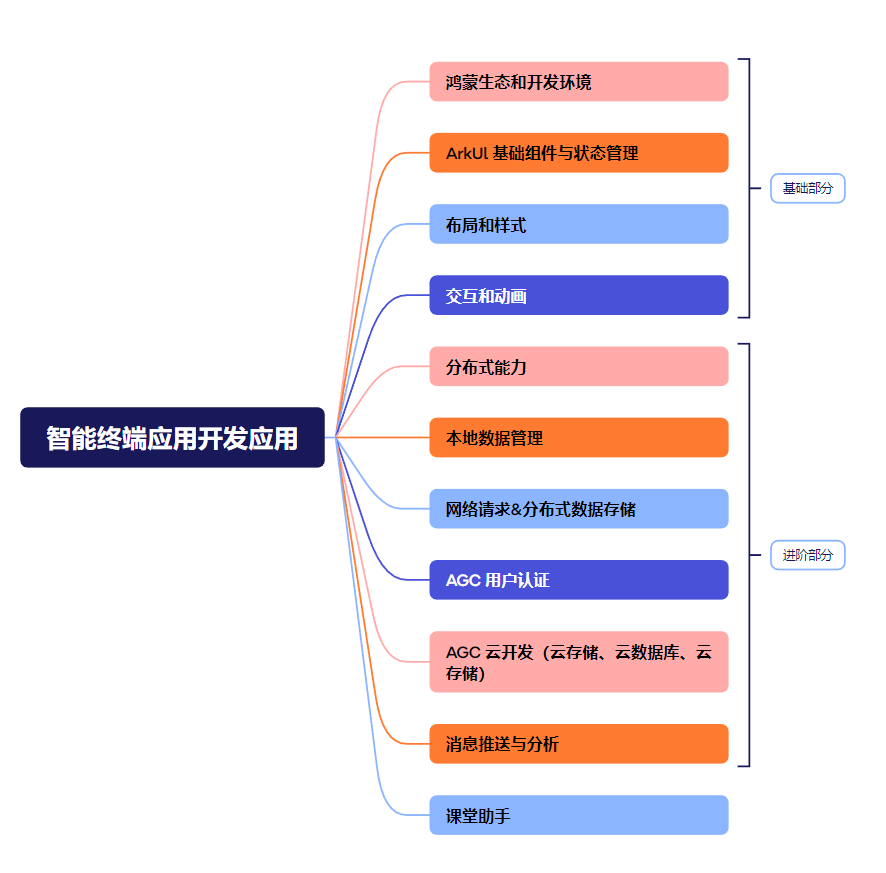

# 鸿蒙应用基础项目 README

## 项目介绍

本项目是基于 HarmonyOS 开发的基础应用框架，包含鸿蒙应用开发的核心组件、页面路由、状态管理等基础功能，适合初学者快速上手鸿蒙应用开发。


## 环境要求

- DevEco Studio: 4.0+
- HarmonyOS SDK: API 9+
- JDK: 11.0+
- Node.js: 14.19.1+
- Node-gyp: 8.4.1+

## 快速开始

### 1. 克隆项目

```bash
git clone https://github.com/yourusername/harmonyos-basic-app.git
cd harmonyos-basic-app
```

### 2. 环境配置

1. 安装 [DevEco Studio](https://developer.harmonyos.com/cn/develop/deveco-studio)
2. 打开 DevEco Studio，通过`File > Settings > HarmonyOS SDK`配置 SDK
3. 点击`File > Open`导入当前项目

### 3. 运行应用

1. 连接鸿蒙设备或启动模拟器
2. 点击工具栏中的运行按钮(▶️)
3. 等待应用编译安装完成

## 项目结构

```
src/main/
├── ets/
│   ├── entryability/       # 应用入口
│   ├── pages/              # 页面组件
│   ├── model/              # 数据模型
│   └── common/             # 公共工具
├── resources/              # 资源文件
│   ├── base/               # 基础资源(字符串、颜色等)
│   ├── media/              # 图片等媒体资源
│   └── rawfile/            # 原始文件
├── module.json5            # 模块配置
└── main_pages.json         # 页面路由配置
```

## 核心功能

- 基础 UI 组件使用示例
- 页面导航与路由管理
- 状态管理与数据绑定
- 资源文件使用方法
- 事件处理机制

## 开发规范

1. 页面文件命名: PascalCase (如: HomePage.ets)
2. 组件命名: PascalCase
3. 方法与变量命名: camelCase
4. 常量命名: UPPER_SNAKE_CASE

## 常见问题

- **Q: 编译报错 "Failed to resolve dependency"**
  A: 执行`ohpm install`安装依赖，或检查网络连接

- **Q: 模拟器启动失败**
  A: 检查 HVD Manager 是否已登录，或尝试创建新的模拟器

- **Q: 应用安装提示签名错误**
  A: 在`Project Structure > Project > Signing Configs`配置签名信息

## 学习资源

- [HarmonyOS 官方文档](https://developer.harmonyos.com/cn/docs/documentation/doc-guides/overview-0000001053902446)
- [DevEco Studio 使用指南](https://developer.harmonyos.com/cn/docs/documentation/doc-guides/deveco-studio-overview-0000001053582415)
- [鸿蒙开发论坛](https://developer.huawei.com/consumer/cn/forum/block/harmonyos)

## 许可证

本项目基于 Apache License 2.0 许可证开源，详情见 [LICENSE](LICENSE) 文件。

## 联系方式

- 邮箱: dev@example.com
- GitHub: [yourusername](https://github.com/yourusername)
